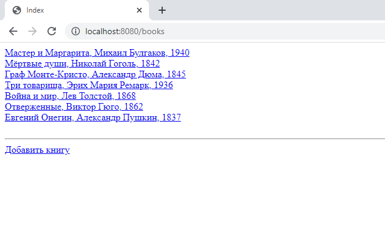
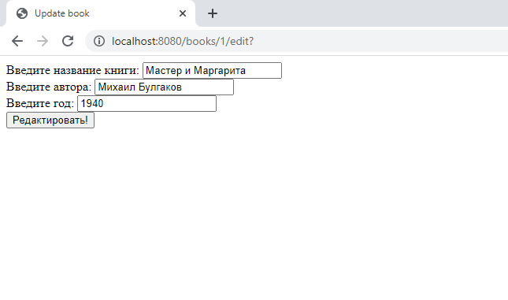

# Библиотека

## Описание
Веб-приложение позволяющее перейти библиотеке на цифровой учет книг.
Библиотекари имеют возможность регистрировать читателей, выдавать им
книги и освобождать книги (после того, как читатель возвращает
книгу обратно в библиотеку).

## Технологии
Java 8, Spring MVC, Spring WEB, Spring JdbcTemplate, MySQL, Validation, Thymeleaf

## Возможности и опции:
1) Добавление, изменение и удаление человека и книги.
2) Вывод на экран списка всех людей и книг 
3) Страница человека, на которой показаны значения его полей и список книг, которые он
   взял.
4) Страница книги, на которой показаны значения полей этой книги и имя человека,
   который взял эту книгу.
5) На странице книги, если книга взята человеком, рядом с его именем есть быть кнопка
   "Освободить книгу". После нажатия на эту кнопку книга снова
   становится свободно и пропадает из списка книг человека.
6) На странице книги, если книга свободна, выходит выпадающий список 
   со всеми людьми и кнопка "Назначить книгу". После нажатия на эту кнопку, книга
   должна начать принадлежать выбранному человеку и должна появится в его списке
   книг.
7) Все поля валидируются - с помощью @Valid и Spring Validator, если это
   требуется


## Инструкция по запуску приложения:

1. Подготовить БД и таблицу
```sql
CREATE DATABASE Library;
USE Library;
    
CREATE TABLE Person (
                       id int AUTO_INCREMENT PRIMARY KEY,
                       full_name varchar(100) NOT NULL UNIQUE,
                       year_of_birth int NOT NULL
);

CREATE TABLE Book (
                     id int AUTO_INCREMENT PRIMARY KEY,
                     title varchar(100) NOT NULL,
                     author varchar(100) NOT NULL,
                     year int NOT NULL,
                     person_id int REFERENCES Person(id) ON DELETE SET NULL
);
```
2. Клонировать репозиторий: `https://github.com/M-Magomedov/Library.git`
3. Настроить Apache Tomcat
   В Intellij Idea нажимаем на Edit Configuration рядом с кнопкой запуска, выбираем Tomcat Server -> Local, в появившемся окне нажимаем Configure и находим архив tomcat (скачиваем при необходимости)
   
   Переходим в Deployment, добавляем артефакт
   
   Нажимаем Apply, OK. Сервер готов
4. Запустить приложение на локальном сервере.

## Все люди


## Добавить человека


## Информация о человеке, который взял книги


## Информация о человеке, который не взял книги


## Изменить информацию человека


## Все книги


## Добавить книгу


## Информация о свободной книге


## Информация о не свободной книге


## Изменить информацию о книге



